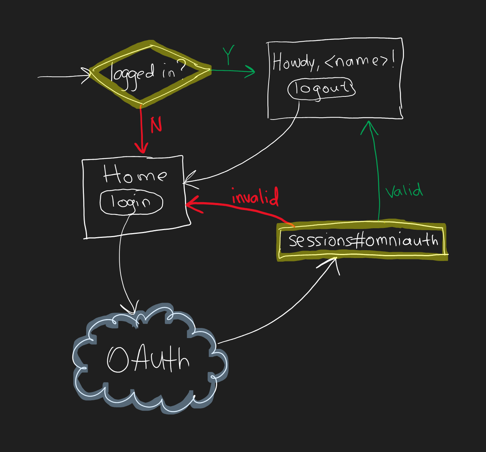

# Teamup - Neo

**Heroku Deployment Link** - https://teamup-neo-ba74edfc326f.herokuapp.com
 
**Code Climate Quality Report** - https://codeclimate.com/github/shahakanksha-tamu/teamup-neo-backend

**TWA Link** - https://docs.google.com/document/d/1UJPuRpy88v_93F4VPQSZGwPWX9yjqdwD4mbKQIw6viM/edit?usp=sharing

Neo is a centralized platform for students enrolled in the Teamup Apps for Good program to track their project milestones and individual progress. This web application will serve as an internal tool to keep students on track, measure their progress, and improve the student's experience throughout the program duration.

The primary objectives of Neo are to:
- Simplify the onboarding process for new students
- Provide a clear overview of project timelines and milestones
- Facilitate easy access to team information and resources
- Enhance student accountability and progress tracking
- Improve overall program management and coordination


## MVP-I Features
1. **User Authentication and Authorization**
   - Implemented a secure login system for users using Google OAuth.
   - Implement role-based access control (RBAC):
     - **Students**: Access to student-specific data and features.
     - **Mentors**: Restricted access to mentor-related features.
   - Logout feature
   - Route protection was implemented to prevent access to protected resources like the dashboard without login.

2. **Basic Dashboard Layout and Navigation**
   - Designed a unified dashboard layout for all user roles.
   - Ensure role-based redirection to the appropriate dashboard sections after login.
   - Set up basic navigation between multiple views like dashboard, project hub, calendar, etc.
  

## MVP-II Features
- **Team and Mentor Information Display**  
  Displays information about team members and key contacts (mentors) on the student dashboard.

- **Student Project Overview**  
  Provides students with a project summary and overview for easy reference.

- **Resource Management**  
  Allows admins and mentors to upload and manage project resources.

- **Team Management for Mentors**  
  Enables mentors to create project teams and manage student memberships within those teams.

## MVP-III Features
- **Project Timeline Visualization**  
  Introduces a Gantt chart or visual timeline for tracking project milestones and deadlines.

- **Task Management for Students**  
  Allows students to view assigned tasks, mark them as complete, and track their progress with a donut chart.

- **Milestone Management for Admins**  
  Enables admins to perform CRUD operations on milestones, track task progress with a donut chart, and mark milestones as complete.

- **Task Assignment by Admins**  
  Allows admins to assign tasks to students and view task assignments by students.

- **Admin Project Overview**  
  Provides an admin dashboard overview with CRUD capabilities for projects and milestone completion tracking.

## MVP-IV Features
- **Certificate Completion**  
  Introduces a feature that allows admins/mentors to assign managed scores of each student towards earning a certificate of completion.

- **Task Progress View Per Student for Admin**  
  Incorporates a progress bar to quantify the progress of the student's task.

- **Events Broadcast Banner**  
  Enables admins to create, manage, and broadcast certain events to all students.

- **Calendar Integration**  
  Integrates the Google Calendar view for students and admins to view their events and schedules.

- **Import Data**  
  Provides an admin to manage the student and mentor data in the application through an Excel sheet or CSV file.


**NOTE:**
The deployed version will only allow users who are registered as users in the database to log in successfully. To successfully register yourselves, add your email id to the users database via seeds.rb file. The registration module is out of scope and has limited capabilities with only admins being able to manage the user data.
 
## Project Set Up

### Prerequisites

**Ruby version**: Ensure you have Ruby version 2.7.0 or higher installed. You can check the version of the ruby installed using the command `ruby -v`. The application used the `ruby 3.3.4` version.

**Rails version**: This project requires Rails 6.0 or higher. You can verify the rails version using the command `rails -v`. The application uses the `Rails 7.2.1` version.


### Clone the repository

```bash
git clone https://github.com/shahakanksha-tamu/teamup-neo-backend.git
cd teamup-neo-backend
```

### Install Dependencies

- Execute the below command to install all the required gems

```bash
bundle install 
```
### Database Setup
- Create database

```bash
rails db:create
```

- Execute the DB migration to create the users table in the local database using the below command

```bash
rails db:migrate
```

- Create seed data into database, use the below command to prepopulate the database with list of authorized users

```bash
rails db:seed
```

### Running Application

- Launch the rails application using the below command, the application will be hosted on http://localhost or http://127.0.0.0 with the default port as 3000

```bash
rails server
```

### Google OAuth Configuration



This section walks you through setting up Google OAuth for your application in the Google Developer Console. Here are the steps and important information:

**Step 1: Create a New Project in Google Developer Console**
- Go to the [Google Developer Console](https://console.cloud.google.com/).
- Select or create a project for your application, giving it a name like "teamup-neo-backend."

**Step 2: Set Up OAuth Consent Screen**
- In your project, navigate to "APIs & Services" and click on "OAuth consent screen."
- Set the user type to "Internal" for only @tamu.edu accounts or "External" for any @gmail account.
- Fill out the required information on the consent screen. You need to provide the app name, user support email, and developer contact information.
- Save your changes.

**Step 3: Add Scopes**
- Add userinfo.email and userinfo.profile
- Click "Save and Continue."

**(Optional) Step 4: Add Test Users**
- You can add test users who are allowed to log in to your application. This means that only the email addresses you add here can access your application. 
- If you choose to add test users, do so on this page and click "Save and Continue."

**Step 5: Create OAuth Client ID**
- On the dashboard, click on "Credentials," then "Create Credentials."
- Select "OAuth client ID" and choose "Web application" as the application type.
- Give your application a name.
- Under "Authorized redirect URIs," add the following:
    - http://localhost:3000/auth/google_oauth2/callback
    - http://127.0.0.1:3000/auth/google_oauth2/callback
- Click "Create."
- You will receive a client ID and client secret. Save this information.
- Ensure that your client ID is enabled.

By following these steps, you have set up the necessary configurations in the Google Developer Console to enable Google OAuth for your application. This allows your app to authenticate users using their Google accounts.

**Add OAuth ID and Secret to Rails Credentials**
Edit the Credentials
  ```bash
  EDITOR=nano rails credentials:edit
  ```

The credentials file will open in the editor.

Add your Google OAuth credentials to the file in the following format. Make sure to maintain the correct indentation and spacing as shown. There should be 2 spaces before client_id and client_secret, and a space after the colon:

```bash
   google:
     client_id: your_client_id
     client_secret: your_client_secret
```

Note: Replace your_client_id and your_client_secret with your own Google OAuth credentials. Do not include any quotes around the actual credentials.

After adding your credentials, save the changes and exit the editor.

Now, your Google OAuth credentials are securely stored in the Rails credentials file and your application will be able to use them for authentication. Make sure to keep your credentials safe and secret.

### Running Tests

**NOTE**: Google OAuth Configuration is required for the application to start up smoothly and run tests.

Execute the below commands to run rspec

```bash
bundle exec rspec
```

Execute below command to run cucumber scenarios

```bash
bundle exec cucumber
```

### Heroku Deployment

**Login to Heroku through CLI**
If you have not already done so, install the [Heroku CLI](https://devcenter.heroku.com/articles/heroku-cli#install-the-heroku-cli).

**Login to Heroku**:

1. heroku login

2. Create a Procfile
    ```bash
    echo "web: bundle exec rails server -p $PORT" > Procfile
    ```

    This file tells Heroku what to do when the application is deployed. In this case: spin up a web process to host the application.

3. Create a Heroku App
    ```bash
    heroku create <app_name>
    ```

4. Verify that the git remote is set:
    ```bash
    git config --list --local | grep heroku
    ```
5. Make Master Key Available on Heroku
    ```bash
    heroku config:set RAILS_MASTER_KEY=`cat config/master.key`
    ```
    This enables Rails on Heroku to decrypt the credentials.yml.enc file, which contains the OAuth credentials (and any other secrets your app needs).

6. Provision a Database
    ```bash
    heroku addons:create heroku-postgresql:essential
    ```
    An essential-0 PostgreSQL database costs $5 a month, prorated to the minute.

7. Add PostgreSQL to Gemfile

    ```bash
    group :production do
        gem 'pg'
    end
    ```
    Run this so that your app won't try to install production gems (like postgres) locally:

    ```bash
    bundle config set --local without 'production' && bundle install
    ```
8. Add the Heroku App to Authorized redirect URIs on Google Cloud Console
    - Go to the [Google Developer Console](https://console.cloud.google.com/).
    - Click on Credentials in the left navigation panel
    - Click on your OAuth 2.0 Client ID for this project
    - Add your Heroku app's callback address as an authorized redirect URI e.g. https://your-apps-name.herokuapp.com/auth/google_oauth2/callback
    - Click "SAVE"

9. Deploy the App to Heroku
    ```bash
    git push heroku main
    ```

10. Migrate the Database
    ```bash
    heroku run rails db:migrate
    ```
11. Seed the Database
    ```bash
    heroku run rails db:seed
    ```

12. Launch the application:
    ```bash
    heroku open
    ```

Your app is now successfully deployed to the production environment.

# Contact Information

Rahaan Gandhi - rahaang99@tamu.edu
Dhruva Khanwelkar - dhruvak@tamu.edu
Akanksha Shah - shahakanksha@tamu.edu
Meghna Pradhan - meghna.pradhan@tamu.edu
Ramneek Kaur - ramneek983@tamu.edu
Hao Jin - q389974204@tamu.edu
Yiyang Yan - yyy2000@tamu.edu


